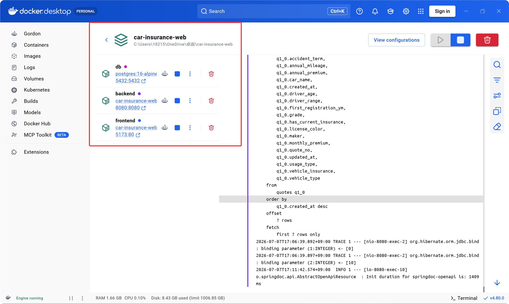
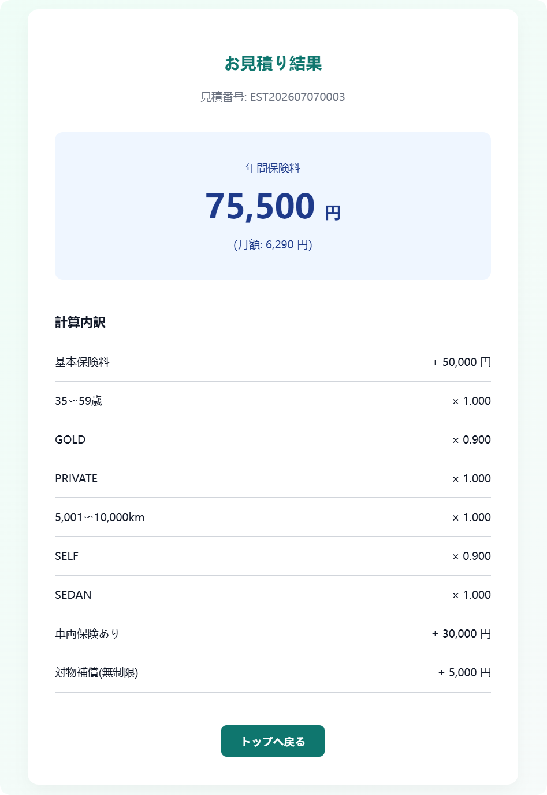
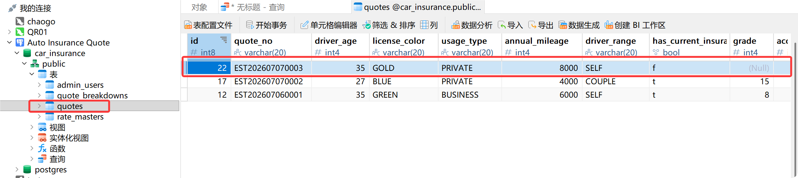
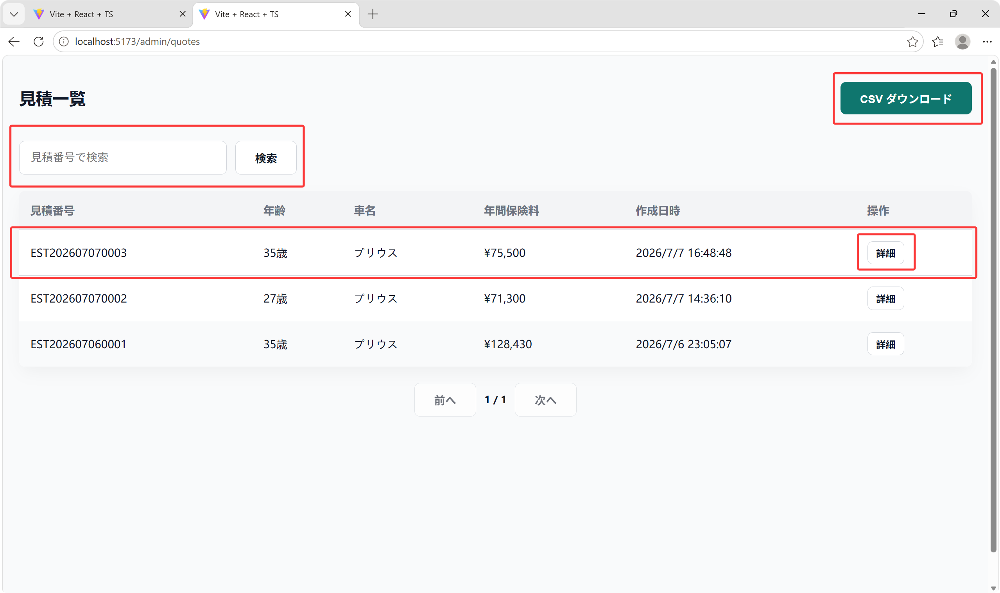
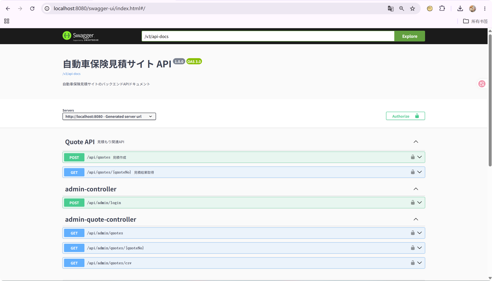

# 最終テストレポート (TEST REPORT)

## 1. 単体・結合テスト (UT / IT)

| ID | テスト対象/API | 結果 | 方法名 |
|---|---|---|---|
| UT-001 | 正常系見積 | OK | `testUT001_NormalQuote` |
| UT-002 | ハイリスク見積 | OK | `testUT002_HighRiskQuote` |
| UT-003 | 年齢境界値 | OK | `testUT003_AgeBoundaries` |
| UT-004 | 走行距離境界値 | OK | `testUT004_MileageBoundaries` |
| UT-005 | 等級境界値 | OK | `testUT005_GradeBoundaries` |
| UT-006 | 端数処理 | OK | `testUT006_RoundingRule` |
| UT-007 | 年齢バリデーション | OK | `testUT007_DriverAgeValidation_ErrorWhenAgeIs17` |
| UT-008 | 保険詳細バリデーション | OK | `testUT008_InsuranceDetailsValidation_ErrorWhenGradeIsMissing` |
| UT-009 | 見積番号生成 | OK | `testUT009_QuoteNoGeneration_UniquePerDay` |
| UT-010 | 見積内訳保存 | OK | `testUT010_QuoteBreakdownSaved` |
| UT-011 | 初度登録年月検証(独自追加) | OK | `testUT011_FirstRegistrationYearMonthValidation_ErrorWhenFuture` |
| IT-001 | POST /api/quotes (見積作成成功) | OK | `testIT001_CreateQuote_Success` |
| IT-002 | POST /api/quotes (必須エラー) | OK | `testIT002_CreateQuote_MissingRequiredFields_Returns400` |
| IT-003 | GET /api/quotes/{quoteNo} (取得成功) | OK | `testIT003_GetQuote_ExistingQuoteNo_Returns200` |
| IT-004 | GET /api/quotes/{quoteNo} (NotFound) | OK | `testIT004_GetQuote_NonExistingQuoteNo_Returns404` |
| IT-005 | POST /api/admin/login (管理者ログイン) | OK | `testIT005_AdminLogin_Success` |
| IT-006 | GET /api/admin/quotes (認証なし) | OK | `testIT006_GetQuotes_WithoutAuth_Returns401` |
| IT-007 | GET /api/admin/quotes (認証あり) | OK | `testIT007_GetQuotes_WithAuth_Returns200` |
| IT-008 | GET /api/admin/quotes.csv (CSV出力) | OK | `testIT008_DownloadCsv_WithAuth_Success` |

## 2. 画面テスト (ST-001 ~ ST-010)

| ID | 画面 | 操作 | 期待結果 | 結果 |
|---|---|---|---|---|
| ST-001 | トップ | 開始ボタン押下 | 使用者情報画面へ遷移する。 | OK |
| ST-002 | 使用者情報 | 未入力で次へ | 必須エラーが表示される。 | OK |
| ST-003 | 使用者情報 | 正常入力で次へ | 契約中保険画面へ遷移する。 | OK |
| ST-004 | 契約中保険 | 現在加入あり、等級未入力 | 等級必須エラーが表示される。 | OK |
| ST-005 | 車両情報 | 未来の初度登録年月を入力 | エラーが表示される。 | OK |
| ST-006 | 補償条件 | 正常選択して次へ | 入力確認画面へ遷移する。 | OK |
| ST-007 | 入力確認 | 戻るボタン押下 | 前画面へ戻り入力内容が保持される。 | OK |
| ST-008 | 入力確認 | 見積作成ボタン押下 | 見積結果画面へ遷移する。 | OK |
| ST-009 | 見積結果 | 画面表示 | 見積番号、年間保険料、月額、内訳が 表示される。 | OK |
| ST-010 | 管理画面 | ログインして検索 | 見積一覧が表示される。 | OK |

## 3. 受入テスト (AT-001 ~ AT-008)

| ID | 確認項目 | 合格条件 | 結果 | 備考・エビデンス |
|---|---|---|---|---|
| AT-001 | Docker起動 | READMEの手順どおりにdocker compose upで起動できる | OK |  |
| AT-002 | 画面操作 | トップから見積結果までエラーなく操作できる | OK |  |
| AT-003 | 計算結果 | 詳細設計書の計算ロジックと結果が一致する | OK | 同上 (AT-002&003.png 参照) |
| AT-004 | DB保存 | 見積ヘッダと内訳がPostgreSQLに保存される | OK |  |
| AT-005 | 管理機能 | ログイン、見積検索、詳細表示、CSV出力ができる | OK |  |
| AT-006 | Swagger | API仕様をSwagger UIで確認できる | OK |  |
| AT-007 | テストコード | 主要な計算・API・画面テストが存在し、実行できる | OK | 本ドキュメント下部のTest Logs参照 |
| AT-008 | README | 起動方法、テスト方法、設計補足、既知の制限が記載されている | OK | [README.md](../README.md)  |

## Evidence (Test Logs)

<details>
<summary><b>Frontend System Tests (<code>npm test</code>)</b></summary>

```
> frontend@0.0.0 test
> vitest

 DEV  v3.2.6 C:/Users/18215/OneDrive/桌面/car-insurance-web/frontend

stderr | src/__tests__/ResultPage.test.tsx > ResultPage > ST-009: should fetch and display quote details correctly
⚠️ React Router Future Flag Warning: React Router will begin wrapping state updates in `React.startTransition` in v7. You can use the `v7_startTransition` future flag to opt-in early.

 ✓ src/__tests__/ResultPage.test.tsx (1 test) 168ms
 ✓ src/__tests__/TopPage.test.tsx (1 test) 166ms
 ✓ src/__tests__/Confirm.test.tsx (2 tests) 223ms
 ✓ src/__tests__/Step2.test.tsx (1 test) 330ms
    ✓ Step2CurrentInsurance > ST-004: should require grade and accidentTerm when hasCurrentInsurance is true  327ms
 ✓ src/__tests__/Step4.test.tsx (1 test) 407ms
    ✓ Step4 Compensation Options > ST-006: should navigate to confirm page when valid options are selected  405ms
 ✓ src/__tests__/Step1.test.tsx (2 tests) 546ms
    ✓ Step1 Driver Info > ST-003: should navigate to step2 when form is valid  364ms
 ✓ src/__tests__/Step3.test.tsx (1 test) 584ms
    ✓ Step3 Vehicle Info > ST-005: should show error when future date is input for registration  582ms
 ✓ src/__tests__/AdminLogin.test.tsx (2 tests) 916ms
    ✓ ST-010: Admin Flow > ST-010: should login, display quote list, and perform search  732ms

 Test Files  8 passed (8)
      Tests  11 passed (11)
   Start at  14:51:07
   Duration  5.82s
```
</details>

<details>
<summary><b>Backend Unit/Integration Tests (<code>mvn test</code>)</b></summary>

```
[INFO] Scanning for projects...
[INFO] -----------------< com.example:car-insurance-backend >------------------
[INFO] Building car-insurance-backend 0.0.1-SNAPSHOT
[INFO] --------------------------------[ jar ]---------------------------------
...
[INFO] --- surefire:3.2.5:test (default-test) @ car-insurance-backend ---
[INFO] Using auto detected provider org.apache.maven.surefire.junitplatform.JUnitPlatformProvider
[INFO] -------------------------------------------------------
[INFO]  T E S T S
[INFO] -------------------------------------------------------
[INFO] Running com.example.carinsurance.controller.AdminControllerIT
  .   ____          _            __ _ _
 /\\ / ___'_ __ _ _(_)_ __  __ _ \ \ \ \
( ( )\___ | '_ | '_| | '_ \/ _` | \ \ \ \
 \\/  ___)| |_)| | | | | || (_| |  ) ) ) )
  '  |____| .__|_| |_|_| |_\__, | / / / /
 =========|_|==============|___/=/_/_/_/
 :: Spring Boot ::                (v3.3.0)

2026-07-07T15:10:26.415+08:00  INFO 31868 --- [           main] c.e.c.controller.AdminControllerIT       : Starting AdminControllerIT using Java 21.0.5...
2026-07-07T15:10:28.893+08:00  INFO 31868 --- [           main] com.zaxxer.hikari.HikariDataSource       : HikariPool-1 - Start completed.
... [Spring/Hibernate SQL Logs Truncated] ...
[INFO] Tests run: 4, Failures: 0, Errors: 0, Skipped: 0, Time elapsed: 7.597 s -- in com.example.carinsurance.controller.AdminControllerTest
[INFO] Running com.example.carinsurance.controller.QuoteControllerTest
... [Spring/Hibernate SQL Logs Truncated] ...
[INFO] Tests run: 4, Failures: 0, Errors: 0, Skipped: 0, Time elapsed: 0.305 s -- in com.example.carinsurance.controller.QuoteControllerIT
[INFO] Running com.example.carinsurance.domain.dto.QuoteRequestTest
[INFO] Tests run: 2, Failures: 0, Errors: 0, Skipped: 0, Time elapsed: 0.302 s -- in com.example.carinsurance.domain.dto.QuoteRequestTest
[INFO] Running com.example.carinsurance.domain.service.calculation.QuoteCalculationServiceTest
[INFO] Tests run: 6, Failures: 0, Errors: 0, Skipped: 0, Time elapsed: 0.329 s -- in com.example.carinsurance.domain.service.calculation.QuoteCalculationServiceTest
[INFO] Running com.example.carinsurance.domain.service.QuoteServiceTest
[INFO] Tests run: 2, Failures: 0, Errors: 0, Skipped: 0, Time elapsed: 0.159 s -- in com.example.carinsurance.domain.service.QuoteServiceTest
[INFO] 
[INFO] Results:
[INFO]
[INFO] Tests run: 19, Failures: 0, Errors: 0, Skipped: 0
[INFO]
[INFO] ------------------------------------------------------------------------
[INFO] BUILD SUCCESS
[INFO] ------------------------------------------------------------------------
[INFO] Total time:  11.237 s
[INFO] Finished at: 2026-07-07T15:10:34+08:00
[INFO] ------------------------------------------------------------------------
```
</details>
